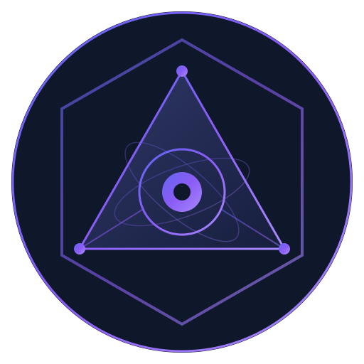

<p align="center">
  
</p>

# EGOS Lab — Collaborative Open Source Ecosystem

> A collaborative network where ideas become code, beginners become contributors, and rules evolve through collective intelligence.

**Live:** [egos.ia.br](https://egos.ia.br) | **License:** AGPL-3.0 | **Status:** Active Development

---

## What is EGOS Lab?

EGOS Lab is an open-source monorepo that combines **working applications**, **project blueprints**, **shared tooling**, and **AI-native development workflows**. It's designed for both experienced developers and complete beginners to collaborate on real projects.

### What's Inside

| Layer | Contents | Status |
|-------|----------|--------|
| **Agents** | 11 autonomous agents + orchestrator: SSOT Auditor, Security Scanner, Code Reviewer, UI Designer, Dead Code Detector... | Beta |
| **Apps** | `egos-web` (Mission Control), `eagle-eye` (OSINT gazette monitor), `intelink` (police intel), `radio-philein` | Live / Alpha |
| **Projects** | 14 blueprints from public procurement OSINT to agent-centric architecture | Concept → Alpha |
| **Packages** | Shared AI client, rate limiter, types, config rules | Stable |
| **Docs** | 40+ idea files, 12+ UI designs (Stitch), business strategy, partner packages | Growing |

---

## Quick Start

### For Contributors (humans and AIs)

```bash
# 1. Fork and clone
git clone https://github.com/YOUR_USERNAME/egos-lab.git
cd egos-lab

# 2. Install dependencies
bun install

# 3. Run Mission Control locally
cd apps/egos-web && bun dev
```

Or **zero setup**: Open in [GitHub Codespaces](https://github.com/codespaces/new?repo=enioxt/egos-lab)

### For AI Agents (Cursor / Windsurf / Claude Code)

Just open the repo. The `.windsurfrules`, `.cursorrules`, and `.guarani/` files auto-configure your agent with full project context.

---

## How to Contribute

See **[docs/CONTRIBUTING_WITH_AI.md](docs/CONTRIBUTING_WITH_AI.md)** for the full guide.

**TL;DR — you can contribute:**
- **Code**: Fix bugs, add features in `apps/` or `packages/`
- **Ideas**: Submit to `docs/plans/` or open an Issue with `idea` label
- **Rules**: Share `.guarani/`, `.windsurfrules`, lint, pre-commit configs
- **Reviews**: Review PRs with structured feedback
- **Docs**: Improve READMEs, add tutorials, translate

### Contributor Levels

| Level | Title | Requirements |
|-------|-------|-------------|
| 0 | Explorer | Sign up, browse, vote |
| 1 | Apprentice | Complete onboarding |
| 2 | Builder | 3+ merged PRs |
| 3 | Architect | 10+ contributions + reviews |
| 4 | Guardian | Community nomination |

---

## Ecosystem Map

> **🗺️ Deep Dive:** See [docs/SYSTEM_MAP.md](docs/SYSTEM_MAP.md) for a complete inventory of every file, module, and line of code in the repository.

```
egos-lab/
├── agents/                 ← Agentic Platform (11 registered, 20 planned)
│   ├── runtime/runner.ts   ← Core: registry, logger, correlation IDs
│   ├── registry/agents.json← Agent definitions (SSOT)
│   └── agents/*.ts         ← SSOT Auditor, Auth Checker, etc.
├── apps/
│   ├── egos-web/           ← Mission Control (egos.ia.br)
│   ├── eagle-eye/          ← OSINT gazette monitor + AI
│   ├── intelink/           ← Police intelligence platform
│   └── radio-philein/      ← Community radio (paused)
├── packages/shared/        ← AI client, rate limiter, types
├── projects/               ← 14 project blueprints
├── docs/                   ← Knowledge base, case studies, strategy
└── .guarani/               ← Agent identity + coding rules
```

Full map with all 14 projects: [docs/OPEN_SOURCE_PLAN.md](docs/OPEN_SOURCE_PLAN.md)

---

## Vision: The Collaborative Network

We're building more than a repo — we're building a **collaborative social platform for developers** that sits on top of GitHub:

- **Idea Marketplace**: Submit ideas, community votes, auto-scaffolded projects
- **Rule Forge**: Share and compose `.guarani`, `.windsurfrules`, lint configs
- **Structured Reviews**: Better than PRs — 48h SLA, scored feedback, consensus voting
- **Full Onboarding**: From "what is an IDE?" to "merged my first PR"
- **Gamification**: Cred scores, badges, streaks, leaderboards
- **AI-Native**: Agents help write docs, review code, guide beginners

Read the full plan: [docs/OPEN_SOURCE_PLAN.md](docs/OPEN_SOURCE_PLAN.md)

---

## Tech Stack

| Layer | Technology |
|-------|-----------|
| Runtime | Bun (agents, scripts, CLI) |
| Frontend | React + Vite (egos-web) |
| API | Vercel Serverless |
| Database | Supabase PostgreSQL |
| Auth | Supabase Auth (GitHub OAuth) |
| AI | OpenRouter (Gemini 2.0 Flash) |
| Agents | Custom runtime + registry + JSONL logs |
| CI | GitHub Actions + Husky pre-commit |

---

## Connect

**Enio Rocha** — AI Architect @ EGOS Lab | Founder @ [Carteira Livre](https://www.carteiralivre.com)

- [LinkedIn](https://www.linkedin.com/in/eniorochaxt)
- [X (Twitter)](https://x.com/anoineim)

---

*"The best open source isn't just code. It's ideas, rules, reviews, and the humans who connect them."*
