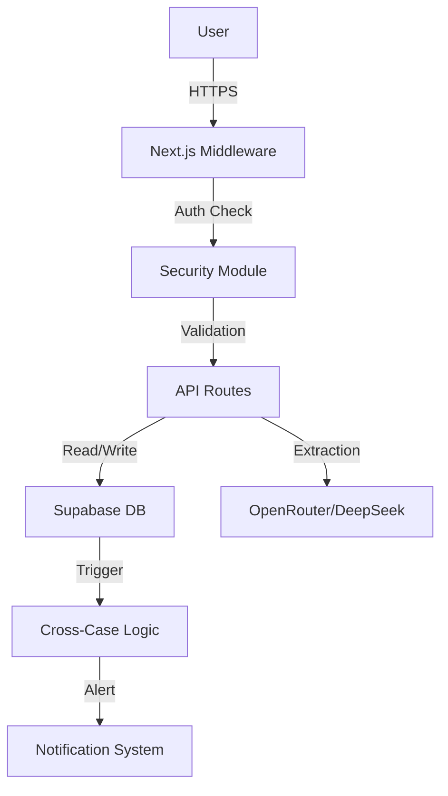

# 🏛️ INTELINK System Architecture

**Version:** 4.0.0 (SOTA Security + Cross-Case RAG)
**Date:** 2025-12-05

---

## 1. High-Level Overview

Intelink is a specialized intelligence platform for police investigations, designed to ingest unstructured data (PDFs, DOCX, Audio), extract structured entities, and identify connections between disparate cases using AI and Graph Theory.

### Core Value Proposition
- **Unified Intelligence:** Breaking silos between investigations.
- **Automated Analysis:** Reducing manual reading time by 80%.
- **Security First:** Granular access control and audit trails.

---

## 2. Tech Stack

| Layer | Technology | Purpose |
|-------|------------|---------|
| **Frontend** | Next.js 14 (App Router) | React framework, SSR/CSR |
| **Styling** | TailwindCSS + Shadcn/UI | Component library, responsive design |
| **Database** | Supabase (PostgreSQL) | Relational data, Auth, Vector Store |
| **AI/LLM** | Gemini 2.0 Flash / DeepSeek | Entity extraction, reasoning, chat |
| **Vector DB** | pgvector | Semantic search, RAG |
| **Validation** | Zod | Runtime type checking |
| **Testing** | Vitest | Unit and integration testing |
| **Security** | Custom SOTA Module | Rate limit, Auth, Audit, Headers |

---

## 3. Key Features & Modules

### 3.1. Ingestion Engine (`lib/document-extraction.ts`)
- **Multi-format:** PDF, DOCX, TXT, Images (OCR).
- **Pipeline:** Upload -> Hash (Dedup) -> Text Extraction -> LLM Entity Extraction -> Structuring.
- **Entity Types:** Person, Vehicle, Location, Organization, Company, Phone, Firearm.

### 3.2. Investigation Management
- **Flow:** Create -> Feed (Upload) -> Analyze.
- **Roles:** Delegado, Escrivão, Investigador (Granular permissions).
- **Evidence:** Secure storage in Supabase Storage with RLS.

### 3.3. Cross-Case Intelligence (`lib/intelink/cross-reference-service.ts`)
- **Real-time Triggers:** Database triggers detect duplicates on insertion.
- **Matching Logic:** Exact match on CPF, Phone, Plate; Fuzzy match on Name.
- **Alerts:** System notifies users of connections with other investigations.

### 3.4. RAG Chat System (`lib/intelink/ai-chat.ts`)
- **Context Awareness:** Investigation context + Cross-case insights.
- **Vector Search:** `match_documents` RPC for semantic similarity.
- **Persistence:** Chat history saved and shareable between team members.

### 3.5. Security Module (`lib/security/`)
- **Middleware:** Global protection, session validation.
- **RLS:** 100% coverage on Supabase tables.
- **Audit:** Logging of all sensitive actions (View, Create, Delete).
- **Rate Limit:** Protection against abuse (LLM cost control).

---

## 4. Data Flow



---

## 5. Deployment Readiness

### 5.1. Environment Variables
Required for Production:
- `NEXT_PUBLIC_SUPABASE_URL`
- `NEXT_PUBLIC_SUPABASE_ANON_KEY`
- `SUPABASE_SERVICE_ROLE_KEY`
- `OPENROUTER_API_KEY`
- `DEEPSEEK_API_KEY`
- `TELEGRAM_BOT_TOKEN`

### 5.2. Scalability
- **Database:** Supabase scales vertically.
- **Compute:** Vercel Serverless Functions.
- **Storage:** Supabase Storage (S3 backed).

### 5.3. Monitoring
- **Logs:** `intelink_activity_log` table.
- **Telemetry:** `intelink_telemetry` table (client-side events).
- **Health:** `/api/health` endpoint.

---

## 6. Directory Structure (Key Paths)

```
apps/intelink/
├── app/
│   ├── api/                 # Backend Routes
│   ├── chat/                # Chat Interface
│   ├── investigation/       # Case Management
│   └── central/             # Intelligence Hub
├── components/
│   ├── intelink/            # Domain Components
│   ├── investigation/       # Forms & Views
│   └── chat/                # Chat UI
├── lib/
│   ├── security/            # SOTA Security
│   ├── intelink/            # Core Logic
│   └── prompts/             # System Prompts
└── docs/                    # Documentation
```

---

**Maintainer:** Enio & Cascade
**Last Audit:** 2025-12-05
