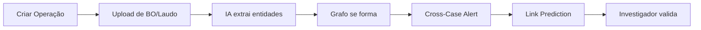
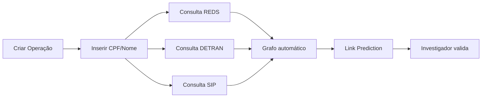

# 📊 Diagnóstico de Mercado — Intelink

**Data:** 2025-12-16  
**Versão:** 1.0.0  
**Para:** Apresentação PC-MG

---

## 🎯 RESUMO EXECUTIVO

O **Intelink** está **PRONTO PARA DEMONSTRAÇÃO** à cúpula da Polícia Civil de MG. O sistema oferece funcionalidades competitivas com soluções de mercado que custam 10-100x mais, com diferenciais únicos como o **Rho Protocol** (detecção de viés cognitivo).

### Status de Maturidade

| Fase | Status | Observação |
|------|:------:|------------|
| **Demo** | ✅ PRONTO | Funcionalidades core operacionais |
| **Piloto** | 🟡 PARCIAL | Precisa de dados reais + convênios |
| **Produção** | 🔴 3-6 meses | Integrações + auditoria LGPD |

---

## 📈 ANÁLISE DE MERCADO

### Concorrentes Diretos

| Produto | Preço/Ano | Força | Fraqueza |
|---------|:---------:|-------|----------|
| **IBM i2 Analyst's Notebook** | ~$50k | Grafo avançado, timeline | Sem IA generativa, Windows only |
| **Palantir Gotham** | ~$1M | Integração ampla, IA | Custo proibitivo |
| **Maltego** | ~$12k | OSINT automatizado | Foco não-policial |
| **Intelink** | ~$5k | IA generativa, mobile, Rho | Sem integrações gov (ainda) |

### Matriz de Funcionalidades

| Feature | Intelink | i2 | Palantir | Maltego |
|---------|:--------:|:--:|:--------:|:-------:|
| Grafo Visual | ✅ | ✅ | ✅ | ✅ |
| Link Prediction (IA) | ✅ | ❌ | ✅ | ❌ |
| Extração de Docs (IA) | ✅ | ⚠️ | ✅ | ❌ |
| Cross-Case Alerts | ✅ | ⚠️ | ✅ | ❌ |
| **Cognitive Bias (Rho)** | ✅ | ❌ | ❌ | ❌ |
| Mobile/PWA | ✅ | ❌ | ⚠️ | ❌ |
| Timeline Interativa | ✅ | ✅ | ✅ | ❌ |
| Transcrição Áudio | ✅ | ❌ | ✅ | ❌ |
| Deploy Cloud | ✅ | ❌ | ✅ | ✅ |
| Custo Acessível | ✅ | ❌ | ❌ | ⚠️ |

### Diferencial Competitivo Único

1. **Rho Protocol** — Nenhum concorrente detecta viés cognitivo do investigador
2. **IA Generativa** — Extração de documentos via Gemini 2.0 Flash
3. **Custo** — 10-100x mais barato que concorrentes
4. **Mobile-First** — Interface moderna responsiva

---

## 🔄 FLUXO DO INVESTIGADOR

### Fluxo Atual (Manual)

**Status:** ✅ 100% Funcional

### Fluxo Ideal (Com Integrações)

**Status:** 🔒 Depende de convênios com PC-MG

---

## 🚀 FUNCIONALIDADES OPERACIONAIS (SOTAs)

### 1. Extração de Documentos
- **Tecnologia:** Gemini 2.0 Flash
- **Formatos:** PDF, DOCX, TXT, Áudio (Whisper)
- **Status:** ✅ Produção

### 2. Link Prediction
- **Algoritmos:** Adamic-Adar (40%) + Jaccard (30%) + Common Neighbors (20%) + Preferential Attachment (10%)
- **Status:** ✅ Produção - Testado com 86 entidades, 534 relacionamentos

### 3. Cross-Case Alerts
- **Detecção:** CPF, Placa, Nome (95%+ similaridade)
- **Status:** ✅ Produção

### 4. Rho Protocol (Viés Cognitivo)
- **Detecção:** Tunnel Vision, Confirmation Bias, Anchoring
- **Status:** ✅ Produção

### 5. Guardian AI (Qualidade de Dados)
- **Validação:** CPF, datas, campos obrigatórios
- **Status:** ✅ Produção

### 6. Grafo Visual
- **Tecnologia:** react-force-graph (2D e 3D)
- **Status:** ✅ Produção

### 7. Timeline Interativa
- **Tecnologia:** Custom React component
- **Status:** ✅ Produção

### 8. Provenance UI
- **Padrão:** NATO Admiralty Scale (6x6)
- **Status:** ✅ Produção

---

## 🔴 GAPS E PRÓXIMOS PASSOS

### Gap 1: Integrações Governamentais

| Base | Prioridade | Esforço | Dependência |
|------|:----------:|:-------:|-------------|
| REDS | P0 | 2-4 sem | Convênio PC-MG |
| DETRAN | P1 | 2-4 sem | Convênio DETRAN-MG |
| SIP | P2 | 4-8 sem | Acesso SEJUSP |
| INFOSEG | P3 | 8-12 sem | Convênio Federal |

### Gap 2: Templates de Extração

| Documento | Status | Ação |
|-----------|:------:|------|
| B.O. REDS | 🟡 | Criar prompt específico |
| Laudo Pericial | 🟡 | Criar prompt específico |
| Inquérito Policial | 🔴 | Desenvolver |
| Interceptação Tel. | 🔴 | Desenvolver |

### Gap 3: Busca Semântica

- **Atual:** Busca textual simples
- **Ideal:** "Encontre casos similares a este"
- **Esforço:** 2-3 semanas (embeddings já existem)

### Gap 4: Relatórios Estruturados

- **Atual:** Export PDF básico
- **Ideal:** Relatório formatado para IP/Denúncia
- **Esforço:** 2-4 semanas

---

## 📋 RECOMENDAÇÕES PARA A REUNIÃO

### O que demonstrar:

1. **Criação de operação** (30s)
2. **Upload de BO real** → extração automática (2min)
3. **Grafo se formando** com entidades (1min)
4. **Cross-case alert** detectando suspeito em outro caso (1min)
5. **Link prediction** sugerindo conexões (1min)
6. **Rho Protocol** alertando sobre viés (1min)
7. **Mobile** funcionando (30s)

### O que pedir:

1. ✅ Acesso de teste à API do REDS (ou dump anonimizado)
2. ✅ Acesso de teste à API do DETRAN
3. ✅ Feedback sobre o fluxo de trabalho
4. ✅ Indicação de delegacia para piloto
5. ✅ Contato técnico para integração

---

## 📊 MÉTRICAS DO SISTEMA

### Código

| Métrica | Valor |
|---------|:-----:|
| Arquivos TypeScript | 482 |
| Endpoints API | 135 |
| Componentes React | ~120 |
| Linhas de código | ~50k |

### Infraestrutura

| Recurso | Tecnologia |
|---------|------------|
| Frontend | Next.js 16 + Turbopack |
| Database | Supabase PostgreSQL |
| Auth | Supabase Auth + OTP |
| Storage | Supabase Storage |
| Deploy | Vercel (auto) |
| IA | Gemini 2.0 Flash, Groq Whisper |

### Dados de Teste

| Métrica | Valor |
|---------|:-----:|
| Investigações teste | 3 |
| Entidades | 86 |
| Relacionamentos | 534 |
| Evidências | ~20 |

---

## ✅ CONCLUSÃO

O **Intelink** está pronto para:

1. ✅ **Demonstração** à cúpula da PC-MG
2. 🟡 **Piloto** em delegacia (precisa de dados reais)
3. 🔴 **Produção estadual** (3-6 meses + convênios)

### Ação Imediata Recomendada:

Agendar demonstração com:
- Delegado-Geral ou Adjunto
- Setor de Tecnologia da PC-MG
- Representante do CINDS

---

*"A inteligência policial do futuro é assistida por IA, não substituída por ela."*
