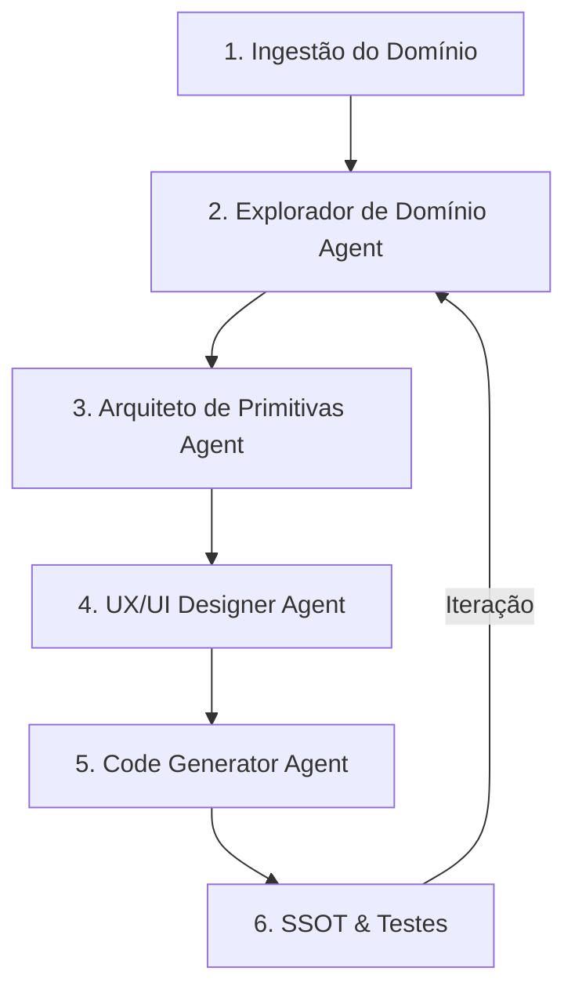

# The Agnostic Domain-to-Solution Engine (The "Descript" Revelation)

> **DATE:** 2026-02-20
> **STATUS:** Conceptual / Foundation
> **VISION:** Transform ANY domain into a powerful, scalable software solution through iterative agentic discovery and implementation.

## 1. The Revelation: How Did Descript Do It?

O usuário observou a interface web do Descript (um editor de vídeo completo rodando suavemente no navegador) e teve uma epifania: *"Como eles conseguiram isso? Várias IAs procurando novas features e implementando? Serve pra qualquer assunto?"*

**O Segredo do Descript (O que eles fizeram no passado):**
A resposta não é que eles usaram IAs para escrever o código (eles começaram antes do boom da IA generativa), mas sim a **Arquitetura de Primitivas**. Eles pegaram um domínio ultra-complexo (edição de áudio e vídeo, FFmpeg, renderização), mapearam todas as operações básicas (cortar, transcrever, sobrepor, exportar) e criaram um banco de dados estruturado (o Notion deles) que gerencia isso. Eles transformaram a edição de vídeo em edição de texto.

**A Sua Epifania (O que NÓS podemos fazer agora no EGOS-lab):**
Sim, você está 100% correto. Com a plataforma de agentes do EGOS-lab, nós podemos **automatizar a própria descoberta e implementação** que levou anos para o Descript. 
Nós podemos criar uma máquina (Engine) onde você insere um domínio (ex: "Edição de Vídeo", "Registro de Marcas no INPI", "Gestão de Autoescolas"), e múltiplas IAs trabalham em pipeline para:
1. Mapear o domínio inteiro (todas as features possíveis, ferramentas de baixo nível como FFmpeg).
2. Reduzir a complexidade em "Primitivas" (blocos de montar).
3. Projetar a arquitetura (banco de dados, UI).
4. Gerar e iterar o código.

## 2. The Engine: Architecture for Agnostic Domain Generation

Para que isso seja "fácil, escalável, leve e agnóstico", precisamos construir a **Domain-to-Solution Engine** (ou Nexus Forge) dentro do EGOS-lab.

### Pipeline de Iteração Contínua (O Fluxo de Trabalho)

### Os Novos Agentes (A serem adicionados ao `agents.json`)

1. **domain_explorer (O Pesquisador):**
   - **Input:** Uma palavra ou frase ("Despachante de Trânsito", "Editor de Vídeo").
   - **Ação:** Usa ferramentas de busca web (Exa/Tavily) e documentação para extrair TODAS as features possíveis, ferramentas open-source existentes, e dores dos usuários.
   - **Output:** Um JSON/Markdown massivo com a taxonomia do domínio.

2. **primitive_architect (O Redutor de Complexidade):**
   - **Input:** A taxonomia do domínio.
   - **Ação:** Transforma centenas de features em blocos de montar simples. (Ex: Em vez de programar 50 efeitos de vídeo diferentes, ele descobre que todos usam a tag `-vf` do FFmpeg).
   - **Output:** Estrutura de dados (Tabelas do Supabase, Interfaces TypeScript).

3. **solution_iterator (O Construtor Contínuo):**
   - **Ação:** Pega a base e, de forma contínua e autônoma, vai injetando novas features no código-fonte do projeto alvo, rodando testes, e validando se quebrou algo.

## 3. Por Que Isso é o "Santo Graal"?

- **Agnóstico:** Não importa se é o INPI, o DETRAN, ou a Adobe. Tudo é informação. Se um domínio tem regras e processos, os agentes podem mapeá-lo e codificá-lo.
- **Escalável:** O "teto" de desenvolvimento deixa de ser a quantidade de horas que você consegue programar, e passa a ser a sua capacidade de apontar o *Domain Explorer* para o problema certo.
- **Leve:** Baseado na filosofia de Andrew Mason (CEO do Descript): "Tudo deve ser um banco de dados estruturado". O código gerado não tenta reinventar a roda, ele apenas cria interfaces limpas para ferramentas sólidas que já existem por baixo (como fizemos com o WebAssembly e o FFmpeg).

## 4. Próximos Passos (Implementados hoje)

- Criado a base do **Domain Explorer** na pasta `agents/agents/domain_explorer.ts`.
- Adicionado o workflow `/domain` no `.windsurf/workflows/domain.md`.
- Esse novo pipeline materializa qualquer domínio do zero e arquiteta soluções poderosas iterando.
